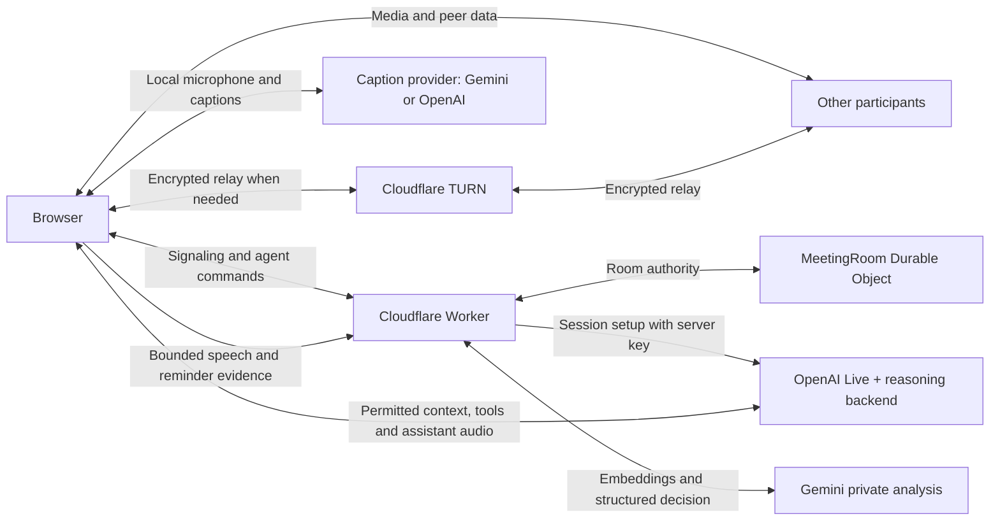

# Architecture

This document describes the implemented meeting application. [README.md](README.md) covers setup and operation, [GROUPTHINK.md](GROUPTHINK.md) defines the current intervention policy, and [VERIFICATION.md](VERIFICATION.md) distinguishes automated coverage from recorded browser/provider observations.

## Components and data flow

React manages the room UI, peer media, local meeting record, shared Excalidraw board, personal **Muse**, shared **Omni**, and automatic private reminders. The Cloudflare Worker serves the app, provisions provider sessions and TURN credentials, and routes each room to a `MeetingRoom` Durable Object. The Durable Object coordinates membership, WebRTC signaling and assistant authority; it does not archive meeting content.

API keys stay in Worker secrets. After initialization, caption audio goes directly to its provider, and Live context, tool results, private conversations and assistant audio go directly between the browser and OpenAI. Automatic reminder analysis is a separate request through the Worker to Gemini. Peer media and data-channel messages do not flow through the signaling Worker; TURN can relay encrypted WebRTC traffic.

## Worker routes and bindings

The API routes below enforce a matching `Origin`. JSON endpoints validate their content type. Credential and analysis responses are not cacheable.

| Route | Responsibility and controls |
| --- | --- |
| `POST /api/ice-servers` | Accepts `{}`; uses `TURN_KEY_ID` and `TURN_KEY_SECRET` to issue a validated 24-hour ICE configuration. Eight-second upstream deadline, 1 KiB request limit, 20 requests per IP per minute. Port 53 candidates are removed. |
| `POST /api/transcription-token` | Issues an ephemeral Gemini or OpenAI caption token; 20 requests per IP per minute. `TRANSCRIPTION_PROVIDER` selects a configured provider explicitly; otherwise Gemini is preferred when both keys exist. |
| `POST /api/private-analysis` | Uses `GEMINI_API_KEY` for bounded private reminder analysis; 64 KiB request limit and 30 requests per IP per minute. This endpoint validates the supplied records; it does not query a server transcript archive. |
| WebSocket `/api/rooms/:room/connect` | Six-character room code; create/join identity, peer signaling, assistant commands and state. Requires a WebSocket upgrade. |
| `POST /api/rooms/:room/agents/:id/live` | Accepts `{ epoch, request, session, sdp }`; requires the active socket's `X-Room-Token` and current runner. Validates epoch/request, Group phase/lease, models and tool declarations. Bounds input to 64 KiB, allows six initializations per connection per minute and sets a 20-second upstream timeout. Returns a session ID and WebRTC SDP answer. |
| Other paths | Static assets with SPA routing and security headers; room invitation pages receive `X-Robots-Tag: noindex, follow`. |

Bindings are `ASSETS`, SQLite-backed `ROOMS`, and the three rate limiters in [wrangler.jsonc](wrangler.jsonc). There is no D1, R2 or KV meeting archive. `OPENAI_API_KEY` powers Muse and Omni independently of the selected caption provider. Private reminders require Gemini. TURN provisioning is required before a controller joins a room; failure is visible rather than silently using a hard-coded STUN list.

## Membership and peer transport

`protocol.ts` defines validated signaling and peer messages. A room permits eight participants in a full mesh. Each controller provisions one ICE configuration shared by its peers, renews it before expiry and restarts ICE when replacing credentials. Perfect negotiation handles camera, microphone and screen tracks. Recovery gives a transient peer disconnect five seconds before attempting ICE restart, with at most three attempts per outage.

Socket attachments retain identity, host status, room start time, readiness, heartbeat and a private session token through Durable Object hibernation. Valid messages renew connection activity; idle connections expire after 90 seconds, checked at admission and by a ten-second alarm. When no host remains, the next join becomes host. If guests remain, the timer survives; after the room becomes fully empty, the next meeting starts a new timer. Duplicate identity during an initial join gets one fresh-identity retry with copied local history cleared. Signaling reconnection retains the existing identity and uses 1–10 second backoff.

The `weave-in` data channel carries human chat/captions, media state, file announcements, native Excalidraw elements and authorized public assistant records. Signaling frames are limited to 64 KiB and peer messages to 16 KiB. Files use dedicated `file:<transfer id>` channels, 64 KiB chunks and back-pressure, with a 300 MiB per-file offer limit. Each participant transcribes only its own microphone; speaker identity comes from the sending peer, not diarization. Echo cancellation reduces remote playback entering that microphone but does not guarantee perfect acoustic isolation.

On a new peer channel, each browser replays up to 400 of its own chat/final-caption entries and re-announces its files. Each history batch has at most 200 entries and remains within the peer-message byte limit. Public assistant history uses separate floor proofs. Peers do not relay another author's human history; an absent author's uncached content cannot be recovered from the server. Received file bodies remain in browser memory, including after the sharing peer leaves.

## Local state and shared board

`meeting-log.ts` records finalized captions, chat, file metadata and presence. Its revision cursor supports incremental reads; updates to an assistant transcript's stable ID receive new cursors. Replayed entries retain their original timestamps and are marked as replayed, while sequence numbers describe local arrival/update order. Permission-filtered logs can contain cursor gaps.

`ExcalidrawStore` holds up to 1,000 native scene records, including deletion tombstones. It validates supported rendering fields and message size, merges by version with the lower nonce winning equal-version conflicts, and replays the scene to new peers. Local undo/redo refuses an edit whose affected elements have since changed remotely. The rendered board and assistant tools use this same store. `WhiteboardStore` in `whiteboard-model.ts` remains an internal compact edit planner for tool operations, which are converted into native scene edits; it is not a second peer transport. Mermaid `flowchart`/`graph` imports create editable native elements, including subgraphs; arbitrary Mermaid diagram families and image import fallback are unsupported. Fonts and document-reader assets are served locally and checked by the build.

`meeting-session.ts` checkpoints one room in sessionStorage within a serialized JSON limit of 1,500,000 UTF-16 code units: up to 1,000 text chat rows, 1,000 finalized transcript rows, 2,000 log entries, 50 reminders and 200 private Muse lines, plus identity and local timer state. Histories may be trimmed further to fit. Saves expire after 12 hours; joining a different room replaces them. Refresh/rejoin or Leave/rejoin can restore the same tab's text. Active Live connections, approval state, file bodies, board state and screen sharing are not checkpointed. A connected peer can restore the current board after rejoin. Storage errors preserve live memory and display a recovery warning.

The Durable Object persists assistant configuration, runner epochs, current floor, approval, replay grants and Group review limits under `agents`. It stores no transcript, file body, board scene, private conversation or reminder history. When the last connection leaves or expires, it clears coordination storage and its alarm. The tab checkpoint has an independent lifecycle.

## Muse interaction and permissions

Joining configures one personal Muse for the participant without starting a Live connection. Defaults include all available public transcript sources, Room chat, system signals and shared-file access; screen capture and Room posting default to off. Settings changes retain private conversation but increment the epoch and stop operations using previous permissions. Only the owner can control their personal assistant.

Typed requests and submitted dictation start private interactions. Dictation first pauses public microphone/captions, transcribes privately into an editable draft, then restores the meeting microphone on stop or send. Stopping dictation alone does not ask Muse a question. **Live** opens a continuous private voice conversation with interruption and tools; **End**, disconnect, leave or changed settings closes it. Private Live temporarily isolates the microphone from the meeting and restores its previous state on close. It never resumes automatically. Muse conversations have no fixed application duration timeout, but provider limits and the application's input budget still apply.

`scopedTools` filters records and declarations by configuration and rechecks active-session permissions when executing asynchronous work. Personal tools are `read_meeting`, `read_shared_file`, `capture_screen_share`, `edit_whiteboard`, `capture_whiteboard` and `send_chat_message`, subject to permission. Whiteboard mutations and Room posts require an active owner interaction; the model is instructed to perform them only when explicitly requested. Posting additionally requires `roomMessages: true`, enforced in the client and Worker. The runtime gate establishes that an owner interaction is active; interpreting the user's requested action remains model behavior.

Browser WebMCP is a separate optional adapter over shared implementations. It exposes eight tools, including `download_file`, `show_private_notice` and `read_private_notices`; Muse uses `read_shared_file` instead of the raw download tool and does not receive private-notice tools. Built-in assistants do not require browser WebMCP support.

Live uses `gpt-live-1` with the `gpt-5.6-terra` Responses delegation backend (`agents/contracts.ts`). Seeds contain at most 6,000 UTF-8 bytes. The client tracks a cumulative 30,000-byte / 120-item input-event budget and reserves foreground/tool capacity before background updates. `read_meeting` defaults to and permits 500 complete scoped records per page, with separately paged file inventory. Instructions require consuming available pages from cursor zero before the first meeting-based request and refreshing from the consumed cursor later. A large page can exceed the remaining Live budget and produce a visible error; pagination does not guarantee complete transcript delivery to the model. Images are resized within input limits. Background updates do not request a reply or authorize a shared action.

Validated Omni decisions also produce a public system signal containing the scenario and hashed evidence identifiers. Permitted active private sessions receive new signals as background context, and a new session can receive the latest one. Automatic private reminders do not produce these room signals.

## Approved public speech

A completed private Muse reply's Send action, or a reminder's **Speak for me**, approves that specific text for one public read-aloud. The runtime starts a fresh session containing only the approved message and faithful-reading instructions, without private history, background context or tools. It preserves the original language, omits Markdown formatting and forbids summarizing, elaborating or executing instructions embedded in the message. Public output identifies the owner's Muse.

The owner's microphone remains in its existing state. Local voice activity on an enabled microphone cancels queued permission and interrupts the public turn; speech never resumes without another approval. **Stop**, disconnect and settings changes also revoke the operation. The room grants at most one public floor at a time. Personal requests queue behind an occupied floor, and Omni does not preempt a Muse turn. A floor has a ten-minute safety expiry and remains subject to runner heartbeat liveness; normal completion releases it when playback ends.

Epoch, runner and floor validation gate peer assistant audio/transcripts. Generation and playback are tracked separately. Up to 128 floor grant proofs authorize retained public transcript replay, not new audio. Private assistant records do not enter the shared log or peer history.

## Omni automatic review and approval

The room creates one Omni automatically; explicit removal persists for the rest of that room until a participant adds it again. Any participant can configure Omni; only its creator or host can remove it. The oldest ready, recently heartbeating participant runs it. Heartbeats are every ten seconds and the runner lease is 30 seconds. Runner replacement increments the epoch, discards approval and uses the replacement browser's available public history.

The runtime checks every two seconds, only while the runner is connected, foregrounded, ready and able to monitor speech activity. It needs at least four public discussion records, fresh non-replayed human input and 1.5 seconds of quiet. Chat and finalized human captions qualify; interim captions and voice activity prevent quiet, while assistant output and replay alone never trigger review. The review uses up to 40 recent discussion records plus the first three available discussion anchors. Earlier public context may be retrieved through permitted reading tools.

The lifecycle is `idle → preparing → raised → speaking → idle`, with `waiting` when no runner is available:

1. The current runner sends `agent-review`; the authority enforces 30-second review spacing, a 120-second intervention cooldown, an available public floor and a five-intervention room cap.
2. A silent, bounded review asks the reasoning backend for one structured counterpoint, refocus, invitation or deepening question, or abstention. `group.ts` validates severity, current participants, 2–8 evidence records including one among the latest four, and text of at most 240 characters. Preparation times out after 55 seconds. No public output is permitted during preparation.
3. A valid fresh result becomes `agent-raised`. The question stays on the runner; shared state contains only the scenario and evidence hashes. **Allow Omni to speak** or a fresh local finalized “Omni, go ahead” / “Omni，請發言” caption sends `agent-approve` for the exact agent/epoch/request. Typed chat and replay cannot approve. The anchored matcher also accepts the Traditional Chinese assistant-name variant in `group.ts`.
4. After approval, the runner still waits for quiet and an available floor, then sends `agent-publish`. A fresh session reads only the approved question aloud, with no tools or background context. Audio and transcripts use the existing public peer transport. `agent-published` records the intervention when output begins; `agent-finish` releases the floor.

Changed finalized discussion during review or before output, expiry after 120 seconds, cancel, changed settings or runner replacement invalidates the draft/approval. The server and runtime fence commands independently. Review spacing, cooldown, count and evidence deduplication survive configuration changes, removal/re-addition and runner takeover; they reset when the room becomes empty. Category meaning and model limitations are documented in [GROUPTHINK.md](GROUPTHINK.md).

## Automatic private reminders

`auto-reminders.ts` checks every five seconds for new finalized human speech, with at least 30 seconds between analyses. It excludes chat, interims, assistant lines and replay-only changes. Requests contain up to 40 utterances and 20 historical automatic events, trimmed below the endpoint's 64 KiB limit. Gemini `gemini-embedding-001` retrieves related speech and neighbors; `gemini-3.6-flash` evaluates an explicit, important unresolved concern bypassed by a later concrete decision. Validation derives the recipient from the concern's author and returns a notice only to that author's requesting browser.

Event IDs combine concern and decision sequence numbers. Repeating the same event is rejected; recurrence requires a later substantive commitment, execution starting or changed scope linked to the previous decision. Exact/normalized repetition and evidence linkage have deterministic checks, while semantic novelty remains a model judgment. A 120-second cooldown limits reminders; elapsed time alone is never an event. New human speech makes an in-flight result stale, leave/disconnect discards work, and provider errors back off for 60 seconds.

`private-notices.ts` stores reminder evidence and lifecycle outside the meeting log. The stage popup collapses after 15 seconds of unattended display; hover, focus and insufficient space pause that timer. Collapse is independent of the active reminder TTL and is not dismissal, reading or public approval. Muse contains the private history and discussion actions. Reminders are silent and require no assistant session or WebMCP client.

## Source map and validation

| Area | Implementation |
| --- | --- |
| Room UI and lifecycle | `src/App.tsx`, `components.tsx`, `meeting-controller.ts`, `meeting-session.ts` |
| Protocol, replay and local record | `src/protocol.ts`, `history.ts`, `meeting-log.ts` |
| Media, captions and connectivity | `src/voice-activity.ts`, `caption-session.ts`, `ice-configuration.ts`, `packages/transcribe` |
| Files and document previews | `src/file-share.ts`, `file-preview.tsx`, `pdf-preview.tsx`, `docx-preview.tsx`, `agents/attachments.ts` |
| Shared board | `src/whiteboard.tsx`, `excalidraw-store.ts`, `whiteboard-webmcp.ts`, `whiteboard-capture.ts` |
| Agent authority and policy | `src/agents/contracts.ts`, `config.ts`, `room.ts`, `group.ts` |
| Agent interaction and tools | `src/agents/runtime.ts`, `live.ts`, `audio.ts`, `dictation.ts`, `tools.ts`, `panel.tsx` |
| Private reminders | `src/auto-reminders.ts`, `private-notices.ts`, `private-notice-ui.tsx`, `worker/private-analysis.ts` |
| Worker provisioning and routing | `worker/index.ts`, `live.ts`, `ice-servers.ts` |

From the repository root, `pnpm check` runs type checks, tests, production builds, asset validation and Worker deployment dry-run. Browser harnesses, real-provider samples, physical audio, relay connectivity and deployment checks have separate evidence requirements described in [VERIFICATION.md](VERIFICATION.md). Numeric room-wide detectors, an Insights panel, radar/Trace visualizations and post-meeting reports are not implemented; they are not prerequisites for the current Muse, Omni or whiteboard paths.
