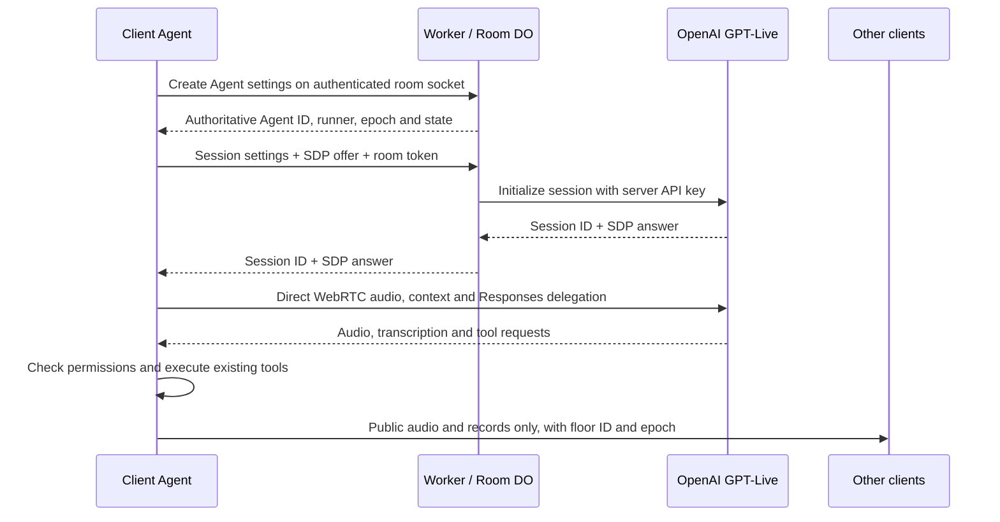

# Architecture

Agents run in the browser. The Worker initializes GPT-Live; the room Durable Object coordinates identity, a single Group runner, and public speaking permission. This is the current implementation. Automated groupthink detection in `GROUPTHINK.md` remains a proposal.

## Data and authority

The server receives Agent settings (including role instructions), connection descriptions and coordination events. It never receives or stores meeting records or private conversations after initialization. Context, screen captures, permitted files and personal conversation are sent directly from the Client to OpenAI. API keys remain Worker secrets. A random token bound to the live room socket authorizes initialization; it is never included in peer lists.

`POST /api/rooms/:room/agents/:id/live` accepts `{ epoch, request, session, sdp }`, requires `X-Room-Token`, and returns `{ session: { id }, transport: { type: "webrtc", sdp } }`. It verifies current runner, lease and Group phase, bounds the request to 64 KiB, validates the model/tool allowlist, and limits each connection to six initializations per minute. The provider request times out after 20 seconds.

## Code ownership

| File | Responsibility |
| --- | --- |
| `src/agents/contracts.ts` | Settings, wire validation, model constants, epochs and floor checks |
| `src/agents/room.ts` | Pure room state transitions: uniqueness, approval, queue, leases and takeover |
| `worker/index.ts`, `worker/live.ts` | Connection identity, durable coordination and authorized provider initialization |
| `src/agents/live.ts` | Native GPT-Live WebRTC, nested Responses events and function results |
| `src/agents/tools.ts` | Scoped adapters over the existing four meeting tools |
| `src/agents/audio.ts`, `runtime.ts` | Client lifecycle, context, transcript routing, microphone and playback gates |
| `src/agents/panel.tsx` | Creation settings, summary, personal conversation and Group controls |

No Agent framework or new dependency is needed. React subscribes to the Client runtime; room transitions are independently testable TypeScript.

## Creation settings

The form progresses through type and role, information sources, tools and output, then a review summary.

| Setting | Personal | Group |
| --- | --- | --- |
| Availability | One per owner | One per meeting; any ready member can create |
| Name | My assistant | Group assistant |
| Markdown role | Editable personal default | Editable facilitator default |
| Answer language | Automatic or specified | Automatic or specified |
| Public caption sources | None / owner / all; default all | All public speakers |
| Public chat | On by default; follows source selection | Always on |
| System signals | Off by default | Always on |
| Screen capture / shared files | Separate permissions, both off | Separate permissions, both off |
| Initial audience | Private by default, or public | Public; approval required |

Owner input is always accepted. Source permissions are immutable for the Agent lifetime: remove and recreate to change them. Role Markdown cannot grant data access, posting or speaking rights. Personal audience may change during the meeting; public mode retains earlier private context and displays a warning, but only subsequent turns are published. Transcription is always recorded with the audience frozen at turn start.

## Turn handling

Personal background captions/chat/signals update context without triggering a response. An explicit owner text question or Talk to assistant starts a bounded GPT-Live session, seeded with the permitted public history and existing personal conversation. This keeps private/public routing attached to one operation even while final transcript fragments arrive after closing. Public Agent records enter the ordinary meeting record and WebMCP; private records never do.

During private voice input, the meeting microphone track is disabled and public captioning is stopped. A separate microphone clone feeds GPT-Live. Public voice input keeps the meeting microphone audible while GPT-Live supplies its transcript, avoiding duplicate captioning. Ending voice restores the previous meeting microphone state. A continuously running silent track drives GPT-Live for typed requests and replaces the microphone when voice input ends. Agent output uses separate Web Audio nodes and separate peer tracks; it is never connected to the human transcription input. A muted media element starts the incoming receiver; only the permission-gated Web Audio graph is audible.

Group state is `idle → preparing → raised → speaking → idle`. A button emits a system signal. Preparation permits read-only tools and gates off all audio and public text. An invited Group starts a fresh session with the suggestion and latest public context. It never replays prepared audio. Repeated signals during preparation/raising coalesce; a signal during speaking schedules another preparation after the turn.

Any member can invite or stop Group speech. Voice invitation matches only a complete current human caption: “團隊助理，請發言” or “Weave, go ahead”. Historical text, chat and Agent transcripts never enter this parser. The creator or original meeting host can remove the Group.

Only one public Agent has the floor. Personal requests queue; an approved Group preempts them and stops private Personal audio on each Client. The owner resumes explicitly afterwards. Private text may still be submitted while Group speaks and is queued for the next personal turn.

Audio generation and playback are separate. Lines carry stable IDs, role, modality, audience and playback status. Stopped/unplayed output is not labelled finished. With GPT-Live's stream rather than per-reply audio-end events, the Client ends a bounded response after two seconds of audible-output silence; a long rhetorical pause can end a reply early. A 60-second public floor, a 55-second text/preparation timeout (180 seconds for private voice), and a 15-second session-close drain bound resource lifetime. Backend work blocks silence-based finalization; typed backend results are passed to the voice frontend through bounded commentary appends, and finalization waits for audio after the result. Longer natural-speech pauses still need listening evaluation.

## Takeover and cleanup

The DO stores Group settings, runner, incrementing epoch, request revision, lease, floor, signal and personal metadata. Every ready Client heartbeats each 10 seconds; a 30-second expiry or explicit disconnect assigns the oldest available ready member. Readiness follows the user's Enable assistant audio action. Initialization failure withdraws readiness so another Client can try. If none are available, the Group displays waiting status.

A new runner reconstructs from its local public record and displays that earlier history may be missing. Interrupted work prepares and raises again. Senders and receivers validate current epoch and floor before tools/audio; recently closed floor IDs are retained for 15 seconds only to finalize delayed transcript fragments, never for playback. Late joiners receive authors' public Agent history and a current stream announcement. Replay carries the original runner/epoch/floor and is checked against the last 128 authoritative grants retained by the DO; older unprovable records are omitted. No interrupted audio is replayed.

Leave/remove stops input and playback immediately, closes provider sessions and discards tool work. The final participant leaving clears DO coordination storage and alarms. This feature does not add accounts, permanent conversation storage, whiteboards, automatic detectors or deployment.

## Verification

`pnpm check` covers type checking, existing tests plus Agent reducer/privacy/session validation, builds and a Worker deployment dry-run. The three-context browser check exercises actual room sockets and peer audio with a simulated GPT-Live WebRTC endpoint. A local real-provider pass on 2026-09-12 also verified GPT-Live initialization, Responses delegation, actual audible output and transcripts, private/public routing across three independent Clients, silent Group preparation, approval with fresh context, and automatic takeover. A synthetic spoken question was also fully transcribed and answered with audible speech while the public microphone was isolated. Synthetic input and automated waveform checks do not replace human microphone/listening evaluation across supported browsers.

Browser results and unresolved network/speech checks are recorded in `VERIFICATION.md`. Input accounting uses UTF-8 bytes and item counts, below the observed provider ceiling of 32,768 bytes / 128 items. Background records are de-duplicated and cannot consume the foreground reserve; file pages and screen images are bounded before transmission. No undocumented provider reset/delete events are used.

Provider contract: [WebRTC initialization](https://developers.openai.com/api/docs/guides/voice-webrtc?api=live), [Responses delegation](https://developers.openai.com/api/docs/guides/live-delegation), [conversation events](https://developers.openai.com/api/docs/guides/live-conversations).
